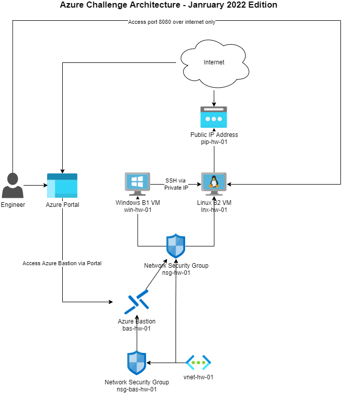

# azure-challenge

Welcome to the Azure challenge.  This challenge is intended to test your basic competency within a typical Cloud and DevOps based scenario.  While it is possible to complete this project and implement a fully functional and complete product, the intention is to give you experience with a full-stack type system development and deployment as well as to gauge your ability to complete, document and think about tasks at a technical level

For this, I recommend you sign up for a Free Azure Account and get Azure credits.  I also recommend [using Azure free tier for all resources](https://adamtheautomator.com/azure-free/).

### Prerequisites

- A Github account
- An Azure Free Account with an Azure AD Tenant - You can use your GitHub account for Single-Sign on if it is not already been used for a trial in the past.
- A credit card for ID check when signing up with Microsoft.  *I am not responsible for anyone not using low or free tier with credits*
- Familarise yourself with [a Azure Naming convention](https://docs.microsoft.com/en-us/azure/cloud-adoption-framework/ready/azure-best-practices/resource-abbreviations).  Using a consistent naming convention is desirable.

All of these challenges can be attempted in any order you wish, and attempting one before another could be considered more optimal depending on your solution. Be aware that solutions which go above and beyond the requirements are going to validate your own learning, so don't hold back and be ready to make justifications, it is intentional the questions are open ended.

Working solutions to all of these challenges can be provided by myself direct, please get in contact via https://craigthacker.dev

Now to get into the challenge:

## Challenge 1: Security Architecture Task: Designing Tenancy Administrative control

For this, you are expected to implement and document how you would add the following users, roles and subscriptions to an Azure AD tenant. Please consider the least privilege and good implementation of automation for future repeatability:

### 1.1
**- Create 4 new users (not guest users) in your tenant with the following roles:**
   - Craig Thacker - Global Administrator
   - Charlie Johnstone - Global Reader
   - Alan Rae - User Access Administrator
   - Dante Alighieri - Custom role, with the ability to turn Virtual machines on or off, but not have the ability to create or delete.
   - Yours - Admin

### 1.2
**- Create 1 subscription:**
  - CyberScot-Hw-Mvp

### 1.3
**- You need to add the following IAM access to these subscriptions: **
  - The user "Craig Thacker" needs only to read all resources in CyberScot-Mvp
  - User "Charlie Johnstone" must be able to manage everything except other people's permissions on all subscriptions
  - User "Alan Rae" must be able only to read and edit the networking resources only in the subscription
  - User "Dante Alighieri" must be able to start and stop VMs in all subscriptions and read all resources, but nothing else
  - Give yourself access to everything

Please note there is more than one way to achieve this, and you are being scored purely on your thought process on this and how you would document it. You should include screenshots and examples of your work.

## Challenge 2: DevOps Task: CI/CD Automation tool implementation

For this challenge, you need to setup an automation tool to run pipelines  and CI/CD on. This tool should have the latest version of Python3 with `pip`, latest Terraform installed and the ability to build OCI or Docker containers.  This can be a hosted tool such as GitHub Actions, Azure Devops or GitLab or a local hosted solution such as Jenkins.  

**You then must then create a pipeline which will output "Hello World!" to the terminal.  How you do this is your choice.**

I would suggest using Azure DevOps or GitHub Actions, but again, this is open to interpretation for the engineer to provide a sufficient solution.

**It is highly recommended you consider your branching and GitOps strategy, it is inadvisable to allow anything to run except a CI on a push to main, consider a merge strategy**

Please consider least privilege and proper security controls when setting this up.  Ensure sufficient documentation is available on your steps.

## Challenge 3: Cloud Engineer Task: Terraform development

With terraform, provision an environment similar to that which follows in the CyberScot-Hw-Mvp subscription:

1. You should allow for sufficient security control inside your system - this does not require the full implementation of endpoint protection, but should consider the process of "least privileged" inline with the other tasks
   
2. Not everything is in the diagram, so make good assumptions and recommendations where appropriate. For example, it is highly recommended that you separate resources into resource groups rather than have all-in-one for better IAM control. Another recommendation is to perform subletting and minimize IP wastage

3. Document what you've done with comments, README's and or diagrams where appropriate.  No such thing as too much documentation!

4. **DO NOT** allow 3389 or 22 exposed to the internet on your VM. Only 8080 on the Linux VM should be exposed to the internet

5. Consider the setup of your Backend, e.g. `backend.tf` and Provider blocks, e.g. `provider.tf` carefully.

## Challenge 4: Automation Task - Start/Stop VMs on a schedule

For the next ask, you need to implement a way for your **Windows Virtual machine to be turned off at 8pm every night and started at 8am every morning**.  This should be fully automated, and you should fully document how you would achieve this and implement it.

## Challenge 5: DevOps Task - Write some application code & package

Using a language of your choice, write a simple API using good coding practices to serve a Hello World API inside the Linux VM.

- Write your code in your framework of choice, the API should be available at the `${DESTINATION_ADDRESS}`/hello-world. It

- Using a containerization platform of your choosing, package your API in, for example, a `docker` or `podman` container with proper consideration for CI/CD, automation and image updating.  You may choose to upload this to Docker Hub or similar if you wish.

- The container should be ran inside the Linux VM with port 8080 externally. but should run 2021 internally. 

- Document your solution fully and write considerations to be made in regards to DevOps automation, security etc.

- You may wish to complete challenge 3 and 4 side by side to prep your VM for a fully automated deployment and proper CI/CD and GitOps, this is open to interpretation

## Challenge 6: Operations Task - Monitor your application

Using your platform of choice, install some form of monitoring on your webapp and test for availability of the app, this data should be displayed in a dashboard.

- One recommendation is to use Grafana for this and expose port 8090 on the Linux VM for this **but not to the internet**, this means you can access your Grafana instance via the Jump server over port 8090, which again is only accessed via Bastion
  
- Another consideration is to use Azure monitor and Azure dashboards, again, this is up to you.

### Remember

Implementing better controls, documenting and understanding your workflow is the intention of this exercise, you are not expected to implement a production grade deployment with all considerations highlighted, that will be for when you are hired :wink:

Keep all your code inside a Git repository and be ready to demonstrate your solution when complete!